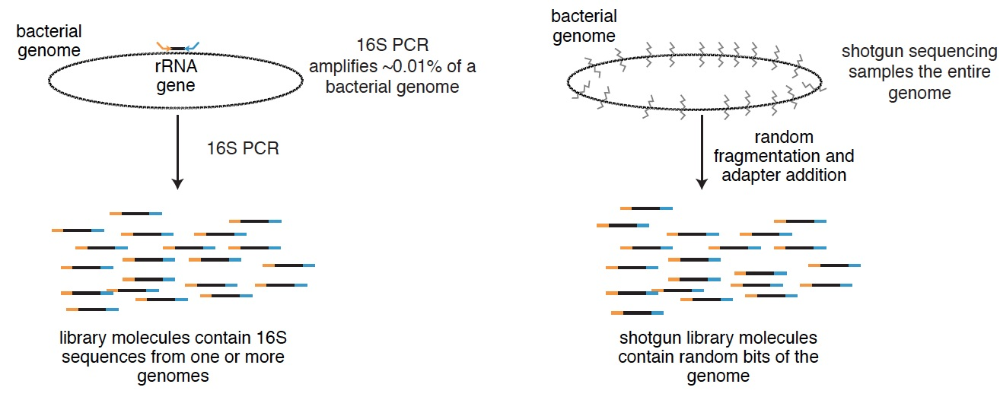
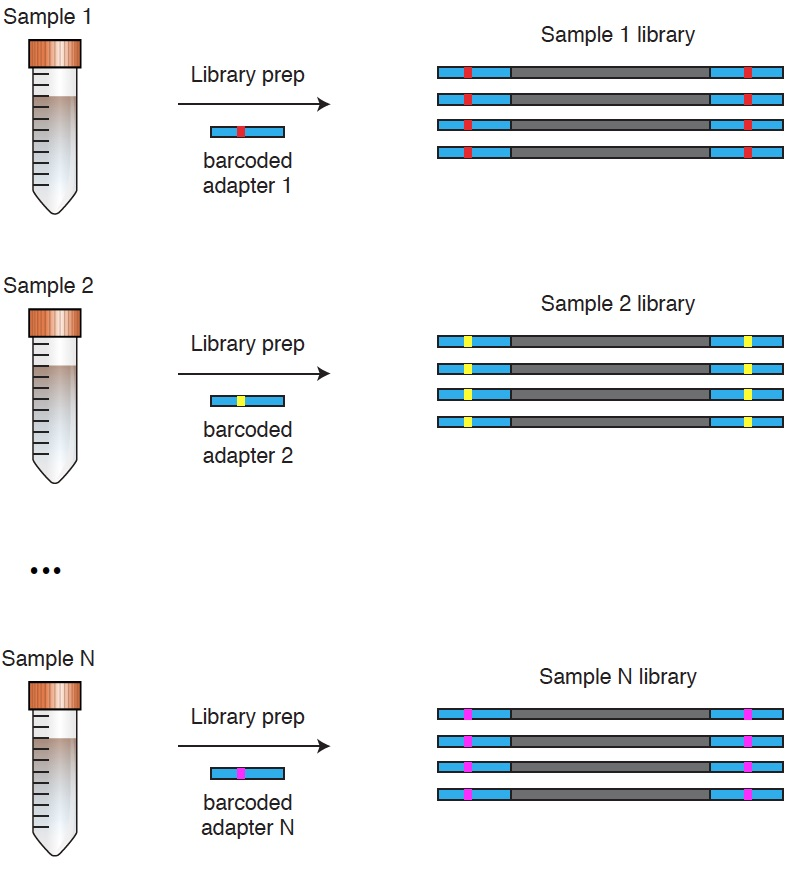
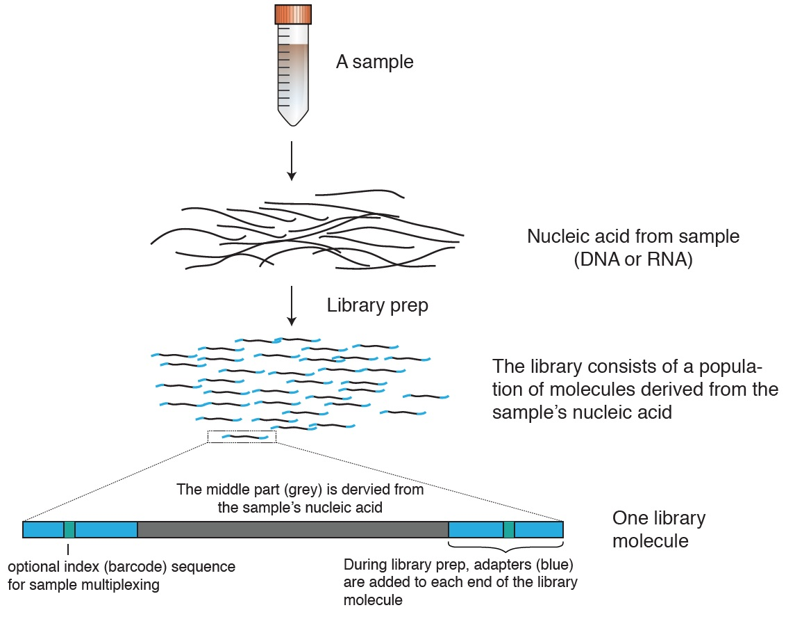
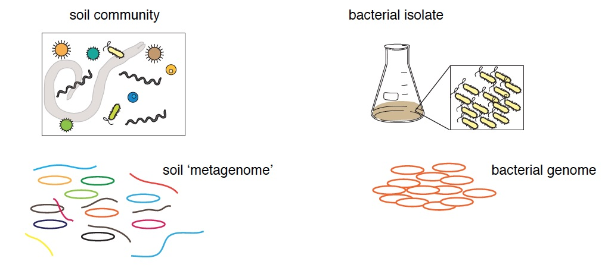
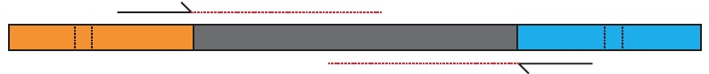
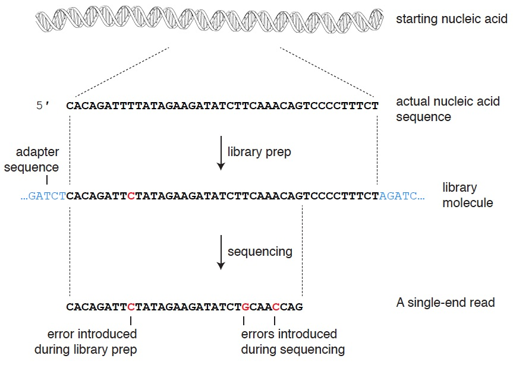
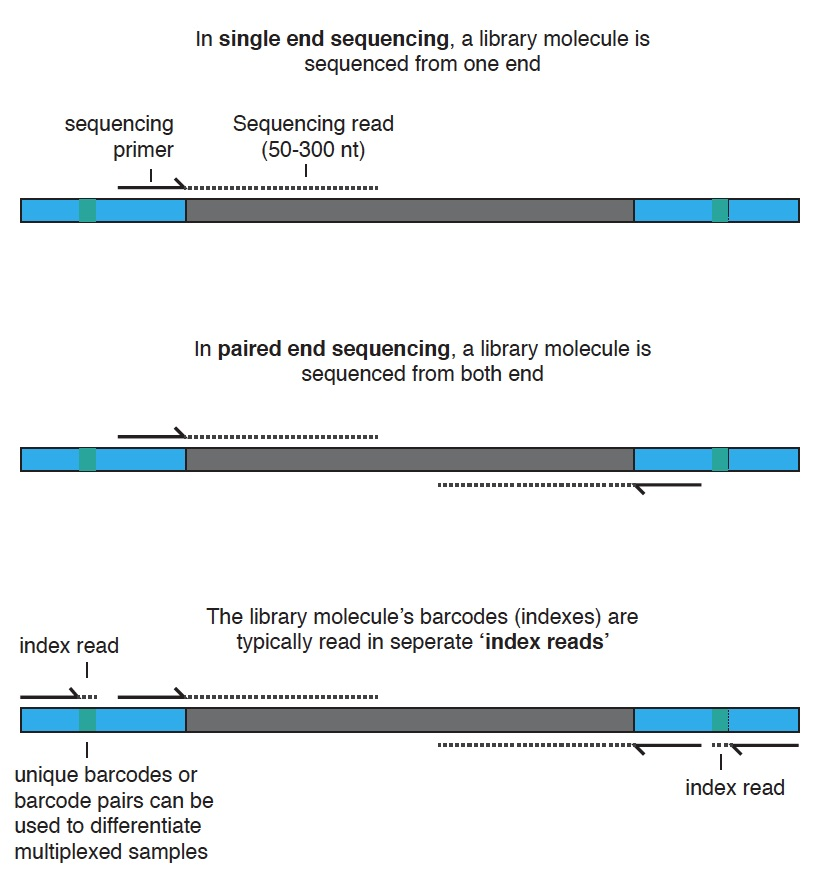

## A (partial) glossary of genomics and sequencing terminology

For [GDW 2017](http://gdwworkshop.colostate.edu/) by [Mark Stenglein](http://www.stengleinlab.org)

- [16S](#16s)
- [Adapter](#adapter)
- [Amplicon sequencing](#amplicon-sequencing)
- [Assembly](#assembly)
- [Barcode](#barcode)
- [Cluster](#cluster)
- [Contig](#contig)
- [Coverage](#coverage)
- [Deep sequencing](#deep-sequencing)
- [De novo assembly](#de-novo-assembly)
- [Exome](#exome)
- [FASTA / FASTQ](#fasta-/-fastq)
- [Index](#index)
- [k-mer](#k-mer)
- [Library](#library)
- [Library Prep](#library-prep)
- [Long read sequencing](#long-read-sequencing)
- [Mapping](#mapping)
- [Metagenomics](#metagenomics)
- [NGS](#ngs)
- [Paired end](#paired-end)
- [Read](#read)
- [Reference sequence](#reference-sequence)
- [Single end](#single-end)
- [Scaffold](#scaffold)
- [SNP](#snp)
- [Transcriptome](#transcriptome)
- [Variant](#variant)
- [WGS](#wgs)

### 16S

The [16S](https://en.wikipedia.org/wiki/16S_ribosomal_RNA) ribosomal RNA gene is present in all bacterial and archaeal genomes.  This gene is sufficiently conserved that primers that anneal to conserved regions of the gene will amplify essentially any prokaryotic 16S rRNA gene.  These PCR products (amplicons) can be sequenced to provide a survey of microbial diversity in a sample.

**Figure: 16S vs. shotgun sequencing.**

### Adapter

Most NGS instruments require that dsDNA of known sequence be added to the 2 ends of [library](#library) molecules that will be sequenced on the instrument.  Adapters can be added in a variety of ways to starting nucleic acid molecules during [library preparation](#library-prep).  Adapters serve multiple purposes. For instance in Illumina sequencing, adapters allow molecules to anneal to flow cells and be amplified into a clonal [cluster](#cluster). Adapters often contain index sequences ([barcodes](#barcode)) that allow samples to be multiplexed.  In Illumina sequencing, barcode sequences are typically read using 'index reads', separate from the main [single](#single-end) or [paired-end](#paired-end) reads. 

### Amplicon sequencing

A type of NGS in which PCR products (amplicons) are sequenced.  [16S](#16S) sequencing is one type of amplicon sequencing.  This is in contrast to shotgun sequencing, where [libraries](#library) consist of complex populations of materials that derive randomly from the starting nucleic acids.

### Assembly

NGS typically produces [reads](#read) that are shorter than the nucleic acids from which they derive.  Assembly is the process by which these short reads are stitched together to attempt to reconstruct the startng nucleic acid sequence.  

### Barcode

In sequencing, a barcode is a sequence that allows samples to be multiplexed for increased cost efficiency and sample throughput.  Barcode sequences are typically contained within the [adapter](#adapter) sequences of a library molecule.  Barcodes allow multiple samples, each defined by a particular barcode sequence, to be multiplexed (i.e. mixed, aka pooled) and sequenced together. The reads from individual samples are sorted by barcode after sequencing.  Barcodes are also often called indexes.  

Library molecules have different adapters on each of their ends, and each adapter can have a distinct barcode.  When both adapters contain barcodes, this is referred to as 'dual indexing'.

**Figure: Illumina library multiplexing.** 

### Cluster

In Illumina sequencing, [library](#library) molecules are hybridized to a flow cell and amplified into a cluster of a few thousand clonal copies.  The large number of copies in a cluster boosts the signal from the incorporation of fluorescent nucleotides.

### Contig

Contig is short for 'contiguous sequence', which are the longer sequences stitched together from overlapping short reads during [assembly](#assembly). 

### Coverage

Coverage, sometimes refered to as 'sequencing depth', is the number of individual reads that support a particular nucleotide in an assembled (reconstructed) sequence or that align to a particular nucleotide in a reference sequence.

**Figure: read depth** _image credit: wikimedia.org_

### Deep sequencing

A synonym for [NGS](#NGS) that you'll hear from time to time.  Perhaps falling out of favor.

### De novo assembly

De novo assembly refers to the fact that most of the time, [assembly](#assembly) involves the reconstruction of an unknown (not yet sequenced) genome sequence.  Most assemblies are de novo assemblies.   

### Exome

The [exome](https://en.wikipedia.org/wiki/Exome) is "the part of the genome formed by exons".  In exome sequencing, [library preparation](#library-prep) includes steps to enrich for exon-derived sequences, which enables focused sequencing of the regions of the genome that code for proteins.

### FASTA / FASTQ

Two common file formats for sequences or sequencing data.  [FASTA format](https://en.wikipedia.org/wiki/FASTA_format). In [FASTQ](https://en.wikipedia.org/wiki/FASTQ_format) files, quality score are associated with individual bases.

### Index

See [barcode](#barcode)

### k-mer

k-mers are sub-sequences of a longer sequence of length k.  The term 'word' is sometimes used to mean roughly the same thing as k-mer.

### Library

A sequencing library is a population of molecules ready to be sequenced.  Libraries can be simple or complex: ranging from a population of PCR amplicons to a complex mixtures of molecules randomly sampled from the starting nucleic acids.

**Figure: overview of sequencing library generation and structure**

### Library Prep

Library prep (preparation) is the process by which starting nucleic acids are converted into a [sequencing library](#library).  There are a great many ways to prepare libraries, but some common steps include (not always in this order or necessarily included):

- Sample selection
- Isolation of nucleic acid from samples
- Enrichment (of nucleic acid subtypes you want) or subtraction (of those you don't want)
- QC of nucleic acid isolates
- Fragmentation of nucleic acid 
- Conversion of RNA into dsDNA (for RNA sequencing)
- Addition of [adapters](#adapter) to ends of library molecules, possibly with [barcodes](#barcode) for multiplexing
- Amplification of library if necessary
- Pooling of multiplexed samples
- QC / quantification of final libraries prior to loading on sequencer.
 
### Long read sequencing

Certain sequencing technologies, such as that of [PacBio](https://en.wikipedia.org/wiki/Single_molecule_real_time_sequencing) and [Oxford Nanopore](https://en.wikipedia.org/wiki/Nanopore_sequencing), produce [reads](#read) that are much longer (many kb long) than Illumina reads (<300 nt).

### Mapping

Mapping is the process by which sequencing reads are aligned to the region of a genome from which they derive.  

### Metagenomics

A variety of related techniques that involve the study of genetic material that goes beyond the study of the genome of a single organism in isolation  

**Figure: ** In metagenomic sequencing, a 'metagenome' composed of the genomes of multiple organisms is studied using sequencing. Contast this to the study of a single genome, for instance [whole genome sequencing](#WGS) of a bacterial isolate.

### NGS

[Next generation sequencing](https://en.wikipedia.org/wiki/DNA_sequencing#High-throughput_methods), aka high throughput sequencing, aka 'deep' sequencing.  Any of a number of sequencing technologies that enable the simultaneous sequencing of a large number of molecules.  Some people get worked up about what to call these technologies, but it doesn't seem worth the effort.

### Paired end

In Illumina sequencing, library molecules can either be sequenced from one end of the molecule or from both ends.  When reads are generated from both ends of the molecule, these are referred to as 'paired' reads.  Depending on the length of the library molecule and the length of the reads, these paired reads may or may not overlap.

**Figure:** Depending on [read](#read) length and library molecule length, paired reads might or might not overlap.

### Read

A sequencing read is a sequence output by a sequencing instrument, almost always shorter than the starting nucleic acid being sequenced, and usually containing errors.  The read's length is a function of the type of instrument used, as are the error profile of reads.  

[Illumina](https://www.illumina.com/techniques/sequencing.html) sequencing typically produces larger numbers (millions) of shorter reads (50-300 nt) with relatively low error rates, whereas [long-read sequencers](#long-read-sequencing) (PacBio, Oxford Nanopore) typcially produce lower numbers of much longer reads (>1 kb) with relatively high error rates.

**Figure: sequencing reads** are sub-sequences of a starting nucleic acid generated by a sequencer, most likely containing errors introduced during library preparation or sequencing itself.

### Reference sequence 

A reference sequence is a genome sequence meant to be representative of the genomes of a particular species.

### Single end

In single-end sequencing, library molecules are sequenced from only one end.  See [paired end](#paired-end).  

**Figure: Illumina sequencing can generate 1-4 reads per library molecule**

### Scaffold

In [assembly](#assembly), [contigs](#contigs) that are known to be proximal in a starting genome sequence can be linked together into a scaffold.  Scaffolding of contigs generated from short reads typically makes use of additional data, such as [long reads](#long-read-sequencing) or [optical mapping](https://en.wikipedia.org/wiki/Optical_mapping).

**Figure: Scaffolds** are generated during assembly by using additional data to join physically linked contigs.  _image credit: wikimedia.org_

### SNP

A single nucleotide polymorphism (SNP) is a nucleotide in a sequence that differs from the corresponding nucleotide in a particular [reference sequence](#Reference-sequence).  SNPs are one type of [variant](#variants), and are sometimes referred to as SNVs (single nucleotide variants).

### Transcriptome

The transcriptome refers to the set of transcripts (mRNAs) in a cell or population of cells.  In transcriptome sequencing (aka RNA-seq), library preparation includes steps that enrich for mRNAs, and the abundance of reads from particular transcripts can be used to estimate the abundance of that transcript.

### Variant

A variant is a difference between a sequence and the corresponding region of a particular reference sequence.  Variants can be single nucleotide (SNVs or [SNP](#SNP)s), or larger insertions, deletions, duplications, etc.

### WGS

Whole genome sequencing (WGS) is the process by which the genome sequence of an organism is determined.  WGS typically involves sequencing, assembly, and annotation, and is not a trivial undertaking.  Sequencing of an additional individual's genome from an already-sequenced species is typically a much more straightforward undertaking.

