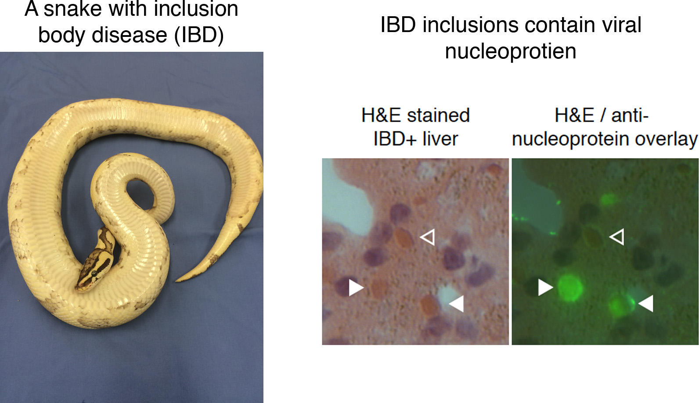

# Downloading and Processing data exercise
GDW 2017

## In this exercise, we will download an NGS dataset and a genome sequence and evaluate them

* Download a dataset from the SRA
* Use the FASTQC tool to assess the quality of the reads in the dataset
* Use trimmomatic to remove low quality parts of the reads1
* Find and download a genome sequence from NCBI


---

### Downloading an SRA dataset

We will download one of the NGS datasets reported in [this paper](http://journals.plos.org/plospathogens/article?id=10.1371/journal.ppat.1004900)

This dataset was generated by performing shotgun sequencing of total RNA from the liver of a boa constrictor that was diagnosed with [inclusion body disease](https://en.wikipedia.org/wiki/Inclusion_body_disease). The dataset is composed of reads from host RNAs and from viral RNAs.  



To get the dataset, open a browser and enter this address, the pubmed page for the dataset's paper:

https://www.ncbi.nlm.nih.gov/pubmed/25993603

Scroll down and find the 'Related information' section of the bottom right of the page.  Click on the SRA link.  This shows the 146 datasets associated with this paper.  Search for `snake_7`.  Note that the reads in this dataset are already trimmed.  Note the run # (SRR #) for this dataset: SRR1984309


First, let's setup a directory (folder) in which to work.  Open the terminal app on your laptop and type these commands:

change (move) to your home directory, if not already there
```
cd
```

Hint: Typing command–+ in the terminal app will increase the font size.   


make a new directory
```
mkdir gdw_working
```

move to that directory
```
cd gdw_working
```

double check you are in the directory you think you are:
```
pwd
```

To get the dataset, we will use the fastq-dump tool, part of the [SRA toolkit](https://trace.ncbi.nlm.nih.gov/Traces/sra/sra.cgi?view=toolkit_doc). 

fastq-dump downloads an SRA dataset.  To run fasta-dump, you just need to specify the run # (the SRR#) of the dataset you want.  Our run # is SRR1984309 

The --split-files option of the command will create separate, synchronized files for paired reads

```
# TODO: absolute path
fastq-dump SRR1984309 --split-files
```

Confirm that you downloaded the files.  You should see files named SRR1984309_1.fastq and SRR1984309_2.fastq

```
ls -lh
```

Have a look at the first 20 lines of the fastq files using the head command
```
head -20 SRR1984309_1.fastq SRR1984309_2.fastq
```

- What is on each of the 4-lines that make up each sequence?  (See: [FASTQ format](https://en.wikipedia.org/wiki/FASTQ_format))  
- The quality scores for this dataset are in Illumina 1.9+ format.  What is the maximum quality score for each basecall?  How does that relate to the estimated probability that a basecall is wrong?
- How many reads are in each file?  (Hint: the `wc -l` command, which will tell you the number of lines in the file)


---


### Using FastQC to evaluate quality of NGS data

[FastQC](https://www.bioinformatics.babraham.ac.uk/projects/fastqc/) is a tool that: 

> ... aims to provide a simple way to do some quality control checks on raw sequence data coming from high throughput sequencing pipelines. It provides a modular set of analyses which you can use to give a quick impression of whether your data has any problems of which you should be aware before doing any further analysis

Performing a quick check like this of your data is one of the first things you'll want to do when you receive your new sequencing data (or when you download a dataset from an online repository like the SRA).

FastQC can be used via a graphical interface or via the command line.  On your laptops, the FastQC graphical interface is on the Desktop in: /GDW_Apps/FastQC

Navigate to that folder and open FastQC.  Then open the fastq files you downloaded from the SRA.  FastQC will take a couple seconds to analyze them.

These datasets have already been pre-cleaned, so they look pretty good.  Note that there is possible Nextera adapter contamination towards the end of some reads.  This makes sense, because the libraries were made with the Nextera protocol.  In the next section, we will trim those off.

---

### Read trimming with trimmomatic

[Trimmomatic](http://www.usadellab.org/cms/?page=trimmomatic) is a tool that can be used to trim low quality and adapter sequences from NGS reads.  It's always a good idea to trim raw NGS reads.

Trimmomatic has _a lot_ of options, described [here](http://www.usadellab.org/cms/uploads/supplementary/Trimmomatic/TrimmomaticManual_V0.32.pdf)

We will run this command to trim our reads:

```
java -jar ~/Desktop/GDW_Apps/Trimmomatic-0.36/trimmomatic-0.36.jar PE  \
	SRR1984309_1.fastq SRR1984309_2.fastq \
	SRR1984309_1_trimmed.fastq SRR1984309_1_trimmed_unpaired.fastq \
	SRR1984309_2_trimmed.fastq SRR1984309_2_trimmed_unpaired.fastq \
	ILLUMINACLIP:../Desktop/GDW_Apps/Trimmomatic-0.36/adapters/NexteraPE-PE.fa:2:30:10 \
	LEADING:20 TRAILING:20 \
	SLIDINGWINDOW:4:20 \
	MINLEN:60

```

_Note that the `\` character at the end of lines allows you to perform a multi-line command at the linux command line._


Breaking this down:
- Names of input and output files: SRR1984309_1.fastq etc.    
- Remove Nextera adapters (ILLUMINACLIP:...NexteraPE-PE.fa:2:30:10)
- Remove leading low quality or N bases (below quality 20) (LEADING:20)
- Remove trailing low quality or N bases (below quality 20) (TRAILING:20)
- Scan the read with a 4-base wide sliding window, cutting when the average quality per base drops below 20 (SLIDINGWINDOW:4:20)
- Drop reads shorter than 60 bases long (MINLEN:60)

After you've completed trimming, look to see that the trimmed files exist in your directory:

```
ls -lh
```

- how many sequences are in the trimmed fastq files?

Open your trimmed fastq files in FastQC.  

- Did the quality of the basecalls improve?
- Did the trimming remove Nextera adapters?

Note: There are other trimming tools that you may find easier to use, such as [cutadapt](http://cutadapt.readthedocs.io/) 

---

### Download the boa constrictor genome.

The dataset we downloaded is from boa constrictor liver RNA.  We are going to map the reads in the dataset to the boa constrictor mtDNA genome sequence to demonstrate read mapping.  We'll do this in tomorrow's exercise.

First, we need to *find* the boa constrictor genome.  As usual, there are few ways we could go about this:

1. navigate through the NCBI [Taxonomy database](https://www.ncbi.nlm.nih.gov/taxonomy/)
2. navigate through the NCBI [Genome database](https://www.ncbi.nlm.nih.gov/genome/)
3. navigate through another genome database, like [Ensembl](http://www.ensembl.org/index.html) or [UCSC](https://genome.ucsc.edu/) 
4. google 'boa constrictor genome sequence'  (not a terrible way to do it)

We will go through the NCBI Taxonomy database.  Navigate to:

https://www.ncbi.nlm.nih.gov/taxonomy/

- Search for `boa constrictor`.  
- Click on Boa constrictor link, then click the Boa constrictor link again
- You should see a table in the upper right corner showing linked records in various NCBI (Entrez) databases.
- Click on the `Genome (1)` link in that table to go to the boa constrictor records in the NCBI Genome database 

- The linked page should say 'No items found', because the boa constrictor genome isn't actually in the NCBI Genome database.  However, there is a mitochondrial genome. Let's download that.
- Click on "See also 1 organelle- and plasmid-only records matching your search"
- In the Replicon Info table, note the link to the boa constrictor mtDNA genome sequence (NC_007398.1)
- Click on this 'NC_007398.1' RefSeq link

Now we need to download the sequence.  We'll do this through the browser.  In the upper right hand corner of the page, note the 'Send' drop down 

- Click Send->Complete Record->File->Format[FASTA]->Create File

You should have downloaded a fasta file of ~19 kb, named sequence.fasta, or something like that.

Now download the sequence in GenBank format too.  Note that this file is larger (~42 kb), because it contains annotation as well as the actual sequence.

Note that the downloaded files have unhelpful names: `sequence.fasta` and `sequence.gb` or similar.  Move these files into your gdw_working folder and rename them something useful:


make sure you are in the gdw_working folder
```
pwd
```

use the mv command to move and rename the files (_change if downloaded names are different_)
```
mv ~/Downloads/sequence.fasta boa_mtDNA.fasta
mv ~/Downloads/sequence.gb boa_mtDNA.gb
```

We want these files in Geneious too.  Drag them into Geneious:  
 - Create a new folder in Geneious 
 - Drag and drop these files into Geneious


### Download another genome a different way

There isn't a boa constrictor genome in NCBI.  Let's download a bacterial genome instead: that of _Chlamydia psittaci_(https://en.wikipedia.org/wiki/Chlamydophila_psittaci).  This will allow us to practice finding and downloading and processing a genome using slightly different approaches.

To find the _C. psittaci_ genome, we will go through the NCBI Genome database.  Navigate to:

https://www.ncbi.nlm.nih.gov/genome/

Search for `Chlamydia psittaci`. This will take you to the genome overview page for this organism. 

You will notice a number of things on this overview page: 
- There are actually 61 C. psittaci genomes.  One of these has been designated a "Representative genome".  We'll download this one. 
- There are a number of paths to the actual genome sequence(s).  One easy one is at the top of the page, where therea are links to "Download sequences in FASTA format."  
   - Hover over the link to download the genome sequence in FASTA format.  Note that this link points to this URL:

ftp://ftp.ncbi.nlm.nih.gov/genomes/all/GCF/000/204/255/GCF_000204255.1_ASM20425v1/GCF_000204255.1_ASM20425v1_genomic.fna.gz

[FTP](https://en.wikipedia.org/wiki/File_Transfer_Protocol) is a protocol for transferring files between computers.

If you click on this link, you can download it to your laptop through your browser.  You can also download it directly from the command line using a utility like [curl](https://en.wikipedia.org/wiki/CURL).  Open your browser and download the C. psittaci genome using curl:
```
curl -O ftp://ftp.ncbi.nlm.nih.gov/genomes/all/GCF/000/204/255/GCF_000204255.1_ASM20425v1/GCF_000204255.1_ASM20425v1_genomic.fna.gz
```

confirm you've downloaded the genome sequence
you should see a file GCF_000204255.1_ASM20425v1_genomic.fna.gz
```
ls -lh 
```

the .gz file extension means this file is gzipped (compressed)
decompress it using gunzip
```
gunzip GCF_000204255.1_ASM20425v1_genomic.fna.gz
```

the file should now be named GCF_000204255.1_ASM20425v1_genomic.fna.gz
```
ls -lh
```

You should see a file of 1.1 Mb 

Look at the first 10 lines of the file:
```
head GCF_000204255.1_ASM20425v1_genomic.fna
```


#### Downloading genome annotation
You will note at the top of the overview page that you can also download annotation for this genome, either as an annotated version of the genome (in Genbank format), or a file containing the annotations (in [GFF](https://en.wikipedia.org/wiki/General_feature_format), or tabular formats)

- Download the annotated genome in Genbank format, and drag and drop it into Geneious.  


---

#### Creating a bowtie index

Now we will create a bowtie2 index from our boa mtDNA sequence.  Indexing pre-processes a sequence to make it faster to map to later.

In your terminal window run these commands:

```
# confirm that the fasta file is there
ls -lh    # should see: NC_007398.fasta

# run bowtie2-build to make index
# this command takes 2 arguments: 
# (1) the name of the fasta file containing the sequence(s) you will index
# (2) the name of the index (can be whatever you want)

bowtie2-build NC_007398.fasta NC_007398

# confirm that you built the index.  You should see a bunch of files named ending in bt2, like NC_007398.3.bt2
ls -lh
```

#### Mapping reads in our dataset to the bowtie index

#### Download the dolphin genome

We are going to map the reads in our dataset to the dolphin genome.  First, we need to *find* the dolphin genome.  As usual, there are few ways we could go about this:

1. navigate through the NCBI [Genome database](https://www.ncbi.nlm.nih.gov/genome/)
2. navigate through another genome database, like [Ensembl](http://www.ensembl.org/index.html) or [UCSC](https://genome.ucsc.edu/) 
3. google 'dolphin genome sequence'  (not a terrible way to do it)

We will go through the NCBI Genome database.  Navigate to:

https://www.ncbi.nlm.nih.gov/genome/

Search for `dolphin`.  Scroll down until you see the record for *Tursiops truncatus* (the bottlenosed dolphin).  Click on that link.

From this overview page, there are a number of paths to the actual genome sequence.  At the top of the page are links to download sequences in FASTA format.  Hover over the link to download the genome sequence in FASTA format.  Note that this link points to this URL:

ftp://ftp.ncbi.nlm.nih.gov/genomes/all/GCF/000/151/865/GCF_000151865.2_Ttru_1.4/GCF_000151865.2_Ttru_1.4_genomic.fna.gz

This is an FTP link, meaning that we can download this file directly from the command line using a utility like [curl](https://en.wikipedia.org/wiki/CURL):

make sure you're in the right directory:
```
cd ~/boa_sra
```

download the dolphin genome sequence using the curl utility
```
curl -O ftp://ftp.ncbi.nlm.nih.gov/genomes/all/GCF/000/151/865/GCF_000151865.2_Ttru_1.4/GCF_000151865.2_Ttru_1.4_genomic.fna.gz
```

** We don't actually want to continue this with the whole genome sequence because it will take a long time to download and index **

Press `ctrl-C` on your keyboard to cancel the curl download


* 10 minutes over a DSL line*

confirm you've downloaded the genome sequence
you should see a file named GCF_000151865.2_Ttru_1.4_genomic.fna.gz 
```
ls -lh 
```

the .gz file extension means this file is gzipped (compressed)
decompress it using gunzip
```
gunzip GCF_000151865.2_Ttru_1.4_genomic.fna.gz 
```

* 1 minute on macbook *

the file should now be named GCF_000151865.2_Ttru_1.4_genomic.fna
```
ls -lh
```

Note that the file went from ~700 Mb to ~2.4 Gb after decompression.  

#### Download the dolphin mtDNA

** We could align reads to the entire dolphin genome, but that would take a time longer than we have for this workshop **
** Instead, we'll align reads to the dolphin mtDNA genome **

Return to the NCBI Genome bottlenosed dolphin page:

https://www.ncbi.nlm.nih.gov/genome/769

Under the Replicon Info section, note the link to the mitochondrial genome: NC_012059.1.  Click that link to go to the Genbank nucleotide record for this genome.

#### As is usually the case in bioinformatics, there is more than one way to do what we want:

* Option 1: Download from website using browser
  * Send->complete record->file->format[fasta]
  * Move this FASTA file to your ~/boa_sra directory using the Finder or the command line

* Option 2: download the sequence in Geneious.
  * Copy the accession # from your browswer page.
  * Open Geneious.  Goto the NCBI->Nucleotide section.
  * Search for the accession (NC_007398.1) .
  * Create a new folder in Geneious.
  * Drag the boa mtDNA sequence to this new folder.
  * Note the nice annotation.
  * Export the sequence in FASTA format.  File->Export->Selected Documents->Fasta sequences/alignment format.  Click through options.o


#### Create a bowtie index of the dolphin mtDNA genome

Now we will create a bowtie2 index from our dolphin mitochondrial genome sequence.  Indexing pre-processes a sequence to make it faster to map to later.

In your terminal window run these commands:

confirm that the fasta file is there
```
ls -lh    # should see: NC_012059.fasta
```

run bowtie2-build to make index
this command takes 2 arguments: 
(1) the name of the fasta file containing the sequence(s) you will index
(2) the name of the index (can be whatever you want)

```
bowtie2-build NC_012059.fasta NC_012059
```
* 1 sec on macbook *

confirm that you built the index.  You should see a bunch of files named ending in bt2, like NC_012059.3.bt2
```
ls -lh
```


#### Map reads to dolphin mtDNA genome

[Bowtie2](http://www.nature.com/nmeth/journal/v9/n4/full/nmeth.1923.html) was developed as a fast short-read mapper.  It aligns short NGS reads to a reference sequence.  Bowtie2 has a nice manual that explains how to use it and what the various parameters mean.

Note that there are a variety of other good read mapping tools, including [HiSat](https://ccb.jhu.edu/software/hisat2/index.shtml), [gmap/gsnap](http://research-pub.gene.com/gmap/), and [STAR](https://github.com/alexdobin/STAR).


```
bowtie2 -x dolphin_mtDNA_bt_index -q -1   -2 --qc-filter --no-unal --threads 4 -S ${output_prefix}.sam
```

Let's deconstruct this command line a little
```
bowtie2 -x dolphin_mtDNA_bt_index -q -1   -2 --qc-filter --no-unal --threads 4 -S ${output_prefix}.sam

```


#### Create a bowtie index of the dolphin genome

Now we will create a bowtie2 index from our dolphin genome sequence.  Indexing pre-processes a sequence to make it faster to map to later.

In your terminal window run these commands:

confirm that the fasta file is there
```
ls -lh    # should see: NC_007398.fasta
```

run bowtie2-build to make index
this command takes 2 arguments: 
(1) the name of the fasta file containing the sequence(s) you will index
(2) the name of the index (can be whatever you want)

```
bowtie2-build NC_007398.fasta NC_007398
```

confirm that you built the index.  You should see a bunch of files named ending in bt2, like NC_007398.3.bt2
```
ls -lh
```


#### De-novo assembly of non-mapping reads


