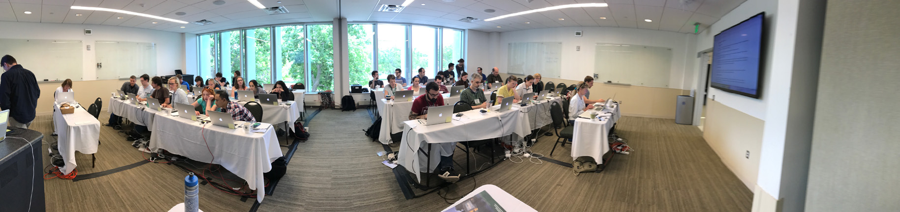

## Genomics of Disease in Wildlife Workshop, Summer 2017

[Course agenda](./GDW2017_Agenda.pdf)

### This page contains links to course material from GDW 2017

We will post as much material as possible as soon as possible.  Our intent is to leave this material online indefinitely.

### Sunday 6/4/17

[Introduction to GDW lecture](./lectures/Pecon-Slattery_Introduction_GDW2017.pdf)

[Introduction to genomics and sequencing Lecture](./lectures/Stenglein_introduction_to_genomics_and_sequencing_lecture.pdf)

[Introduction to databases and online resources lecture](./lectures/Stenglein_databases_lecture.pdf)

[BLAST lecture](./lectures/Fitak_GWD2017_Blast.pdf)

[BLAST exercise](./exercises/Blast_exercise.md)

[Downloading exercise](./exercises/download_exercise.md)

### Monday 6/5/17

[NGS raw data and QC lecture](./lectures/Fitak_GWD2017_NGS-QC.pdf)

[NGS raw data and QC exercise](./exercises/Raw_data_exercise.md)

[Sequence mapping lecture](./lectures/Fitak_GWD2017_Mapping.pdf)

[Sequence assembly lecture](./lectures/Stenglein_de_novo_assembly_lecture.pdf)

[Mapping and de novo assembly exercise](./exercises/mapping_assembly_exercise.md)

[Metagenomics lecture](./lectures/Stenglein_metagenomics_lecture.pdf)

### Tuesday 6/6/17
[Whole Genome Alignment lecture](./lectures/Fitak_GWD2017_WGA.pdf)

### Wednesday 6/7/17
[Sequence alignments: purpose, assessment and application lecture](./lectures/Alignment_talk_GDW2017_Students.pptx)

[Intro to molecular phylogenetics lecture](./lectures/Intro_to_phylogenetics-students.pptx)

[Beast exercise](./exercises/GDW_Beast_Tutorial.pdf)

### Thursday 6/8/17
[Molecular clocks, gene trees and species trees lecture](./lectures/Molecular_Clock_gene_trees_species_students.pptx)

[Selection lecture](./lectures/Fitak_GWD2017_Selection.pdf)

[Testing for selection in genes](./lectures/Testing_for_selection_in_genes_students.pptx)

[PAML exercise material](./exercises/PAML%20Exercise.zip)

[Thursday thought exercise](./exercises/Thought_Exercise.docx)

[Detecting selection exercise](./exercises/Detecting_selection.md)

### Friday 6/9/17

Coming soon

### Saturday 6/10/17

[Intrahost and pooled variation lecture](./lectures/Stenglein_intrahost_variants.pdf)

[Intrahost variation exercise](./exercises/variant_exercise.md)
[Horizon Scan Exercise](./Horizon_Scan_Questions.pdf)

  
