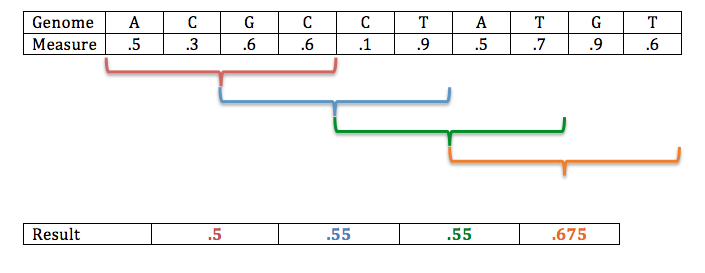

# Detecting Selection
In this exercise we are going to look for evidence of selection by searching for regions of very low genetic variation.  We will do this by searching the alignment of 21 Streptococcus pneumoniae genomes using a sliding window approach.
A sliding window means we are going to:
- start from the beginning of the alignment
- calculate a parameter for a small region (e.g., 100 bases)
- move the window a set number of bases (e.g., 50 bases)
- calculate the parameter again for the new window.
- repeat until we slide the window across the entire alignment.
- Finally, we can summarize our parameters using basic statistics like histograms, means, standard deviations in your favorite stats program (e.g., R, Excel)

A visual example of a sliding window is available below:



Let's begin.

## Step 1: Preparing the software
We are going to use a quick and easy tool, called "gd", written to calculate various measures of genetic variation (i.e., pi, S [# segregating sites], and Tajima's D) in sliding windows across the alignments.  However, this program is not available yet on your computers.  We will have to download it and install it. It is a relatively simple installation, so I pray it works (my fingers are crossed!!!).
```
# Let's move to our home folder
cd ~

# Make a new folder for this exercise
mkdir WINDOW_ANALYSIS

# Move into this new folder
cd WINDOW_ANALYSIS
```

## Cool tip:
If you want to clear your screen to see things easier, enter the command:
```
clear
```
Don't worry, you can still scroll up to see your previous work.

Awesome!  Now we are in our new folder, and ready to download the program "gd".  You can find the program [here](http://guanine.evolbio.mpg.de/bioBox/).  There are two ways to download this program.  You can click on the link to "gd, v0.12".  The file should automatically be downloaded to your "Downloads" folder.  The other method is to download the file using the "curl" command we learned earlier in the week.

If you used the first method (clicking on the download link) then follow these steps
```
# Move the gd program file to your current location
  # The "." means put the file in your current folder
mv ~/Downloads/gd_0.12.tgz .
```

If you want to download using the command line then do this:
```
# Download directly using the curl command.  I copied the link from the website by control-clicking (right-clicking) and selecting "copy link address"
curl -O http://guanine.evolbio.mpg.de/bioBox/gd_0.12.tgz
```

Good! No matter how you downloaded the file, you should now have a file called gd_0.12.tgz in your folder.  Remember how to check the contents of your folder (Hint: ls)?
This file is actually a compressed folder.  We have to uncompress and unpack this file to access its contents.  We can do it in one step.
```
# Unpack and uncompress this file.
tar -zxvf gd_0.12.tgz
```

There should not be a new folder called "Gd_0.12".  Check with your "ls" command.
Now, we are going to move into this folder, then "compile" the program.  It is common for various bioinformatics programs to be sent in this form.  "Compiling" just means to assemble the program from various pieces and customize it to your particular computers settings.  It is "usually" super easy.
Here we go...
```
# Move into the Gd program folder
cd Gd_0.12

# Compile it (it may take a few minutes)
make

# Test that the program works (and read the help menu)
./gd -h

# Move back into your previous folder (the ".." means 'up one folder')
cd ..
```

# Step 2:
We need a FASTA alignment file to use to calculate the various statistics.  Download the file 'Spne.fasta.gz' from the github page in the folder 'exercises'.  This file contains an alignment of 21 *Streptococcus pneumoniae* genomes.  The study is by [Croucher et al. 2015 doi:10.1038/sdata.2015.58](https://www.nature.com/articles/sdata201558).
You can either drag and drop this file into your current folder, or use the following command (assuming you downloaded the file into the 'Downloads' folder).
```
# Move the file to our current folder
mv ~/Downloads/Spne.fasta.gz .
```
Once you have the file in your folder, we need to uncompress it so it is no longer in the '.gz' format.
```
# Uncompress
gunzip Spne.fasta.gz
```
We should now be ready for the last step!!!!

# Step 3:
In this last step we will finally calculate nucleotide diversity, or pi, across windows of our alignment.  Pi is a measure of genetic variation. It only requires one command to run the analysis in 'gd'.  The parameters we are using are just setting the window size parameters.  The parameters are explained after running the command.  The program 'gd' prints the results to the terminal's screen (also called "stdout"), so we will redirect this output to a new file.  The program is also inside of the folder "Gd_0.12", so we must tell the computer where to find it. 
Here we go....
```
# Run gd!
Gd_0.12/gd -s p -w 10000 -S 5000 Spne.fasta > pi.tsv
```
Parameters:
- -s p : which statistic, p = pi, but you can also calculate Tajima's D (t) or the number of segregating sites (s).
- -w 10000 : the width (or length), in base pairs, of the window
- -S 5000 : the step size of the window (how far to slide each time).

Feel free to open the output file to view its contents using your favorite method (using a text editor or commands like "head", "cat", or "less -S"). The output is two columns separated by a tab:
- column 1: the midpoint of the window
- column 2: pi

Your final project, worth 100 points and 100% of your final grade, is to plot the results and find regions that may be under positive selection.  Use your favorite spreadsheet program, like R or Excel.  Plot the window's midpoint (X axis) and pi (Y axis).  I recommend calculating summary statistics, like the mean and standard deviation, to determine if there are any extreme outliers.  When plotting, think about whether or not a log axis may be useful...
If you want to use R, here are the commands (THESE WILL NOT WORK IN UNIX, ONLY IN R)
```
# Load the file as two columns
a=read.table("pi.tsv", sep="\t", header=F)
plot(a$V1,a$V2, log="y", type="l")
```

So, are there any regions under selection?
For 0\*(8x10^19) extra credit points, repeat the analysis but calculate Tajima's D.  What would you conclude?  Anything different?  [Here is a link for how to interpret Tajima's D results](https://en.wikipedia.org/wiki/Tajima%27s_D).

## Thanks everyone!  I hope you enjoyed this tutorial!
