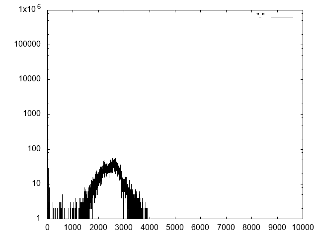

# Examining raw data: Dolphin Adenovirus Identification
In this exercise, we will process raw sequencing data from a bottlenose dolphin (*Tursiops truncatus*) fecal sample

The general steps we will perform are:
- Download the raw sequence data from the SRA archive
- Convert to conventional FASTQ format
- Analyze quality metrics using FASTQC
- Trim low quality sequences and adapter sequences
- Screen for vector contamination
- Count kmers in the trimmed sequence data and plot histogram

## Step 1:  Downloading the raw sequence data
The dataset is described in BioProject [PRJEB14687](https://www.ncbi.nlm.nih.gov/bioproject/?term=PRJEB14687)

First, let's setup a directory (folder) in which to work. Lines that start with a # symbol are comment lines and are just for your information. Open the terminal app on your laptop, then type these commands:
```
# Move to home folder
cd ~

# Make a new folder for this exercise
mkdir DOLPH_VIRUS

# Move into the new folder
cd DOLPH_VIRUS

# Check your current location in the file system (or "Path")
pwd

# You should be in the /Users/intructor/DOLPH_VIRUS folder
```
Now, lets get our raw sequencing data!  GenBank's Sequence Read Archive (SRA) is the database where a majority of raw sequencing data for projects is stored.  These data are stored as a series of "Experiments" and "Runs", each with an accession number.  The acession number we want is ERR1938563. Sequencing data are stored in a highly compressed format ending in .sra.  We need to download this data and convert to the conventional FASTQ format.
```
# The sratoolkit from NCBI has a program "fastq-dump" that can perform these tasks and more
~/Desktop/GDW_Apps/sratoolkit/bin/fastq-dump \
   --split-files \
   --gzip \
   --origfmt \
   --readids \
   ERR1938563
```
The "\\" at the end of the line tells the computer that the command will continue onto the next line.  This notation can help make really long commands look cleaner and easier to understand.
Here is a description of the parameters in the above command:
- --split-files : split the sequences into two files, one with forward reads (mates), the second with reverse mates.
- --gzip : compress the output FASTQ files using gzip.
- --origfmt : Keep the original sequence name in any way.
- --readids : Appends a read id (1 for forward, 2 for reverse) to the end of the sequence name.
The primary difference between this fastq file and the one we downloaded yesterday afternoon is that this fastq file is compressed. This saves a lot of disk space when working with large files.  And since we are not going to open and read these files by eye, we can leave them compressed.  Many bioinformatic tools can work with the compressed files.  

If you forget how to use the "fastq-dump" command, you can check its usage with:
```
~/Desktop/GDW_Apps/sratoolkit/bin/fastq-dump -h
```
The result should be two files:
- ERR1938563_1.fastq.gz
- ERR1938563_2.fastq.gz
```
# Check the files that are in the present folder
ls -lh
```
## Step 2:  Assess sequence quality using FASTQC
FASTQC is a useful tool for visualizing the distribution of basic quality metrics such as length, quality, and potential contamination.
The program has an easy-to-use graphical interface.  We will open the raw sequence files the same way as yesterday using FASTQC

## Step 3:  Trim low quality bases and sequences using TRIMMOMATIC
Now we will use the software TRIMMOMATIC to perform a series of trimming procedures on the raw sequence data.
We will run the command below first, and discuss what is happening while it runs.
```
# Trim Sequences
java -jar ~/Desktop/GDW_Apps/Trimmomatic-0.36/trimmomatic-0.36.jar \
   PE \
   -threads 2 \
   -phred33 \
   ERR1938563_1.fastq.gz \
   ERR1938563_2.fastq.gz \
   ERR1938563_1.trimmed.fastq.gz \
   ERR1938563_1.trimmed.SE.fastq.gz \
   ERR1938563_2.trimmed.fastq.gz \
   ERR1938563_2.trimmed.SE.fastq.gz \
   ILLUMINACLIP:/Users/instructor/Desktop/GDW_Apps/Trimmomatic-0.36/adapters/NexteraPE-PE.fa:2:30:7 \
   LEADING:20 \
   TRAILING:20 \
   SLIDINGWINDOW:4:20 \
   AVGQUAL:20 \
   MINLEN:100
```
Questions:
- How many reads were trimmed?
- How many are still paired?
- Has the quality improved?  Repeat FastQC Analysis above with trimmed reads

## Step 4:  Screen for vector contamination using UNIVEC database
An optional step is to screen the reads for additional contaminating sequences using NCBI's [UNIVEC database](https://www.ncbi.nlm.nih.gov/tools/vecscreen/univec/).
From the website linked above:
"In addition to vector sequences, UniVec also contains sequences for those adapters, linkers, and primers commonly used in the process of cloning cDNA or genomic DNA. This enables contamination with these oligonucleotide sequences to be found during the vector screen."
```
# Download the UniVec database (FASTA format)
curl -O ftp://ftp.ncbi.nlm.nih.gov/pub/UniVec/UniVec_Core

# Remember how to count the number of sequences in a fasta file?
grep -c "^>" UniVec_Core

# Build a blast database
makeblastdb \
   -in UniVec_Core \
   -title UNIVEC \
   -out UNIVEC \
   -dbtype nucl
```
Ok.  So we built a blast database composed of potential contaminating sequences.  Now we need to BLAST our trimmed sequence reads against the database to see if we have matches.  Matches suggest contamination that needs to be removed.  BLAST, however, requires a FASTA input file, and our reads are in FASTQ format.  So we need to uncompress and convert them into FASTA.

```
# Let us first uncompress the trimmed sequencing reads
gunzip ERR1938563_1.trimmed.fastq.gz
gunzip ERR1938563_2.trimmed.fastq.gz

# Now we can use our handy-dandy seqtk toolkit to change the format (sorry about the glitches yesterday).
~/Desktop/GDW_Apps/seqtk-master/seqtk seq -A ERR1938563_1.trimmed.fastq > ERR1938563_1.trimmed.fasta
~/Desktop/GDW_Apps/seqtk-master/seqtk seq -A ERR1938563_2.trimmed.fastq > ERR1938563_2.trimmed.fasta
```
The 'seqtk seq' command above takes in a FASTQ file, and the parameter "-A" tells the program to convert it to a FASTA file format. I don't think we touched on this before, but many programs, like seqtk, normally print the output to the terminal (screen).  However, by adding the ">" character, we can direct this output to a new file.  So in the above commands, we generated entirely new FASTA files called ERR1938563_1.trimmed.fasta and ERR1938563_1.trimmed.fasta.

Now let's BLAST our reads to look for contamination
```
# Blast the forward and reverse sequencing reads
blastn \
   -query ERR1938563_1.trimmed.fasta \
   -db UNIVEC \
   -num_threads 2 \
   -outfmt 6 \
   -out forward-contaminants.tsv
blastn \
   -query ERR1938563_2.trimmed.fasta \
   -db UNIVEC \
   -num_threads 2 \
   -outfmt 6 \
   -out reverse-contaminants.tsv
```
Did you find any contamination?

## Step 5:  Count kmers
Here we will count the frequency of various k-mers (i.e., 31-mer) using the tool [DSK](https://github.com/GATB/dsk).
The analysis of k-mers is used in a variety of applications, including estimating genome size, correcting sequencing errors, identifying repetitive elements, etc..
```
# Optional: Check dsk usage (manual)
~/Desktop/GDW_Apps/dsk-v2.2.0-bin-Darwin/bin/dsk -h

# Count 31-mers
~/Desktop/GDW_Apps/dsk-v2.2.0-bin-Darwin/bin/dsk \
   -file ERR1938563_1.trimmed.fastq,ERR1938563_2.trimmed.fastq \
   -kmer-size 31 \
   -nb-cores 2 \
   -abundance-min 1 \
   -max-memory 1000 \
   -out k31.counts
```
The above command counted 31-mers in the combined forward and reverse reads.  Here is a description of the command parameters used:
- -kmer-size 31 : count kmers of length 31 bp (31-mer)
- -nb-cores : number of computer threads to use.  This mac computer can use up to 4.  Using more cores can speed up the processing of large files.
- -abundance-min 1 : only count k-mers that occur at least this many times.  Sometimes it is useful to ignore rare k-mers, but in our case we will count them all.
- -max-memory 1000 : This tells the computer how much memory to allocate to this analysis.  K-mer counting is actually quite intensive, so this can help avoid using too much memory and failing with large datasets.
- -out k31.counts : the name of the output file.  The file is a specialized compressed format.  For example, there are 4^31 (4.6x10^18) possible 31-mers, which could produce a very, very, very large file in a large sequence file. Therefore compression is often necessary.

Now we will uncompress the output into a nice tab-separated form.
```
# Uncompress the output
~/Desktop/GDW_Apps/dsk-v2.2.0-bin-Darwin/bin/dsk2ascii \
   -file k31.counts.h5 \
   -out k31.table
```
You can now read the new output file using a command like "head" to show the first several lines of the file.  Each line has two columns:
- Column 1 is the actual 31 bp sequence.
- Column 2 is the count of the number of occurrences.

It is common to make plots, such as a histogram, to see the distribution of k-mer counts.  Many statistic tools like R, EXCEL, MATLAB, JMP, or SAS can be used to draw these plots.  However, our small k-mer counts file still has a few million lines, which may slow down some programs like EXCEL.
How big is this file and how many lines (31-mers) are there?
```
# View file information
ls -lh k31.table

# Count the number of lines
wc -l k31.table
```

Unfortunately, we don't have time to go into a detailed tutorial on how to plot data, but the command below is optional to run if you want to create a pretty picture.
```
# Plot with gnuplot
~/Desktop/GDW_Apps/dsk-v2.2.0-bin-Darwin/bin/h5dump \
   -y \
   -d histogram/histogram \
   k31.counts.h5 | \
   grep "^\ *[0-9]" | \
   tr -d " " | \
   paste - - | \
   /Users/instructor/Desktop/GDW_Apps/gnuplot-5.0.6/src/gnuplot -p -e 'set term png; set logscale y; plot  "-" with lines lt -1' > k31.png
```
You can then forget about the command line for a minute, and open the picture (k31.png) by opening the folder and double clicking on it.  It should look like the one below.

Example plot for 31-mer histogram
X-axis: Number of occurences
Y-axis: Count
  
A few questions to consider from this plot:
- Where would you make a cutoff for "true" 31-mers versus "error" 31-mers?
- Can you estimate the genome size?

Extra credit for those interested:
- Repeat at kmer sizes of 15, 21, 27
- Where may we recommend an error correction threshold?
- After trimming, we had leftover unpaired read files.  Does the k-mer distribution look the same in these files?

