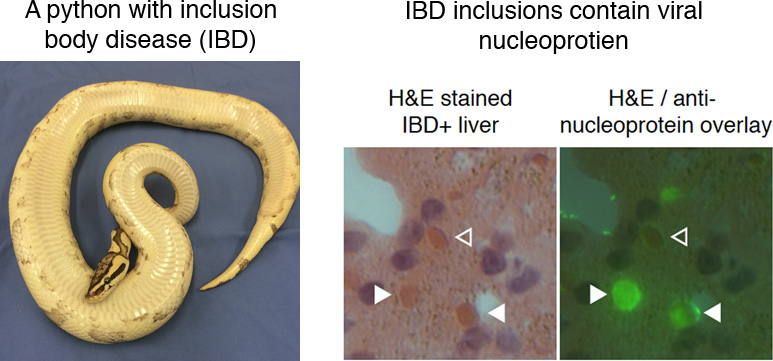

# Downloading and Processing Datasets and Genomes exercise
[GDW 2017](http://gdwworkshop.colostate.edu/)
---

## In this exercise, we will download, process, and evaluate NGS datasets and genome sequences.  We will:

* Download a dataset from the SRA
* Use the FASTQC tool to assess the quality of the reads in the dataset
* Use trimmomatic to remove low quality parts of the reads1
* Find and download genome sequences and associated annotation from NCBI

---

### Downloading an SRA dataset

We will download one of the NGS datasets reported in [this paper](http://journals.plos.org/plospathogens/article?id=10.1371/journal.ppat.1004900)

This dataset was generated by performing shotgun sequencing of total RNA from the liver of a boa constrictor that was diagnosed with [inclusion body disease](https://en.wikipedia.org/wiki/Inclusion_body_disease). The dataset is composed of reads from host RNAs and from viral RNAs.  



To get the dataset, open a browser and navigate to the pubmed page for the dataset's paper:

https://www.ncbi.nlm.nih.gov/pubmed/25993603

Scroll down and find the 'Related information' section of the bottom right of the page.  Click on the SRA link.  This shows the SRA datasets associated with this paper.  Search for `snake_7`.  Note that the reads in this dataset are already trimmed.  Note at the bottom of the page the run # (SRR #) for this dataset: SRR1984309


We're going to download this dataset using the command line tool fastq-dump, part of the [SRA toolkit](https://trace.ncbi.nlm.nih.gov/Traces/sra/sra.cgi?view=toolkit_doc).  First, let's create a directory (folder) in which to work.  Open the terminal app on your laptop and type these commands:

change (move) to your home directory, if not already there
```
cd
```

Hint: Typing command–+ in the Terminal app will increase the font size.   
Hint: You can open multiple tabs in the Terminal app (command–T) 


make a new directory
```
mkdir gdw_working
```

move to that directory
```
cd gdw_working
```

double check you are in the directory you think you are:
```
pwd
```

We will download the dataset using the fastq-dump tool, part of the [SRA toolkit](https://trace.ncbi.nlm.nih.gov/Traces/sra/sra.cgi?view=toolkit_doc). 

To run fasta-dump, you just need to specify the run # (the SRR#) of the dataset you want.  Recall that our run # is SRR1984309. The --split-files option of the command will create 2, synchronized files for the paired reads

```
~/Desktop/GDW_Apps/sratoolkit/bin/fastq-dump SRR1984309 --split-files
```

Confirm that you downloaded the files.  You should see files named SRR1984309_1.fastq and SRR1984309_2.fastq that are each 44 Mb.

```
ls -lh
```

Have a look at the first 20 lines of the fastq files using the head command
```
head -20 SRR1984309_1.fastq SRR1984309_2.fastq
```

- What is on each of the 4-lines that make up each sequence?  (See: [FASTQ format](https://en.wikipedia.org/wiki/FASTQ_format))  
- The quality scores for this dataset are in Illumina 1.9 format.  What is the maximum quality score for each basecall?  How does that relate to the estimated probability that a basecall is wrong?
- How many reads are in each file?  (Hint: the `wc -l name_of_file` command will tell you the number of lines in the file)


---


### Using FastQC to evaluate quality of NGS data

[FastQC](https://www.bioinformatics.babraham.ac.uk/projects/fastqc/) is a tool that: 

> ... aims to provide a simple way to do some quality control checks on raw sequence data coming from high throughput sequencing pipelines. It provides a modular set of analyses which you can use to give a quick impression of whether your data has any problems of which you should be aware before doing any further analysis

Performing a quick check like this of your data is one of the first things you'll want to do when you receive your new sequencing data (or when you download a dataset from an online repository like the SRA).

FastQC can be used via a graphical interface or via the command line.  On your laptops, the FastQC graphical interface is on the Desktop in: /GDW_Apps/FastQC

Navigate to that folder and open FastQC.  Then open the fastq files you downloaded from the SRA.  FastQC will take a couple seconds to analyze them.

These datasets have already been pre-cleaned, so they look pretty good.  Note that there is possible Nextera adapter contamination towards the end of some reads.  This makes sense, because the libraries were made with the Nextera protocol.  In the next section, we will trim those off.

---

### Read trimming with trimmomatic

[Trimmomatic](http://www.usadellab.org/cms/?page=trimmomatic) is a tool that can be used to trim low quality and adapter sequences from NGS reads.  It's always a good idea to trim raw NGS reads.

Trimmomatic has _a lot_ of options, described [here](http://www.usadellab.org/cms/uploads/supplementary/Trimmomatic/TrimmomaticManual_V0.32.pdf)

We will run this command to trim our reads:

**DON'T USE THIS**
```
java -jar ~/Desktop/GDW_Apps/Trimmomatic-0.36/trimmomatic-0.36.jar PE  \
	SRR1984309_1.fastq SRR1984309_2.fastq \
	SRR1984309_1_trimmed.fastq SRR1984309_1_trimmed_unpaired.fastq \
	SRR1984309_2_trimmed.fastq SRR1984309_2_trimmed_unpaired.fastq \
	ILLUMINACLIP:../Desktop/GDW_Apps/Trimmomatic-0.36/adapters/NexteraPE-PE.fa:2:30:10 \
	LEADING:20 TRAILING:20 \
	SLIDINGWINDOW:4:20 \
	MINLEN:60

```
**USE THIS INSTEAD (single line version)**
```
java -jar ~/Desktop/GDW_Apps/Trimmomatic-0.36/trimmomatic-0.36.jar PE  SRR1984309_1.fastq SRR1984309_2.fastq SRR1984309_1_trimmed.fastq SRR1984309_1_trimmed_unpaired.fastq SRR1984309_2_trimmed.fastq SRR1984309_2_trimmed_unpaired.fastq ILLUMINACLIP:../Desktop/GDW_Apps/Trimmomatic-0.36/adapters/NexteraPE-PE.fa:2:30:10 LEADING:20 TRAILING:20 SLIDINGWINDOW:4:20 MINLEN:60 
``` 
_Note that the `\` character at the end of lines allows you to perform a multi-line command at the linux command line._


Breaking this down:
- Names of input and output files: SRR1984309_1.fastq etc.    
- Trim Nextera adapter sequences (ILLUMINACLIP:...NexteraPE-PE.fa:2:30:10)
- Remove low quality bases from the 5' ends of the reads (below quality 20) (LEADING:20)
- Remove low quality bases from the 3' ends of the reads (below quality 20) (TRAILING:20)
- Trim reads if internal low quality bases (SLIDINGWINDOW:4:20)
- Remove reads shorter than 60 bases (MINLEN:60)

After you've completed trimming, look to see that the trimmed files exist in your directory:

```
ls -lh
```

- how many reads remain in the trimmed fastq files?

Open your trimmed fastq files in FastQC.  

- Did the quality of the basecalls improve?
- Did the trimming remove Nextera adapters?

Note: There are other trimming tools that you may find easier to use, such as [cutadapt](http://cutadapt.readthedocs.io/) 

---

### Downloading the boa constrictor genome.

The dataset we downloaded was created by sequencing a library made from boa constrictor liver RNA.  We will map the reads in this dataset to the boa constrictor genome sequence to demonstrate read mapping in tomorrow's exercise.

First, we need to *find* the boa constrictor genome.  As usual, there are few ways we could go about this:

1. navigate through the NCBI [Taxonomy database](https://www.ncbi.nlm.nih.gov/taxonomy/)
2. navigate through the NCBI [Genome database](https://www.ncbi.nlm.nih.gov/genome/)
3. navigate through another genome database, like [Ensembl](http://www.ensembl.org/index.html) or [UCSC](https://genome.ucsc.edu/) 
4. google 'boa constrictor genome sequence'  (not a terrible way to do it)

- Let's choose option 1, and go through the NCBI Taxonomy database.  Navigate to https://www.ncbi.nlm.nih.gov/taxonomy/
   - Search for `boa constrictor`.  
   - Click on Boa constrictor link, then click the Boa constrictor link again
   - You should see a table in the upper right corner showing linked records in various NCBI (Entrez) databases.
   - Click on the `Genome (1)` link in that table to go to the boa constrictor records in the NCBI Genome database 

   - The linked page should say 'No items found', because the boa constrictor genome isn't actually in the NCBI Genome database<sup>[1](#myfootnote1)</sup>.  However, there is a mitochondrial genome. Let's download that.
   - Click on "See also 1 organelle- and plasmid-only records matching your search"
   - In the Replicon Info table, note the link to the boa constrictor mtDNA genome sequence (NC_007398.1)
   - Click on this 'NC_007398.1' RefSeq link

Now we need to download the sequence.  We'll do this through the browser.  In the upper right hand corner of the page, note the 'Send' drop down 

- Click Send->Complete Record->File->Format[FASTA]->Create File

You should have downloaded a fasta file of ~19 kb, named sequence.fasta, or something like that.  

Now download the sequence in GenBank format too.  Note that this file is larger (~42 kb), because it contains annotation as well as the actual sequence.

Note that the downloaded files have unhelpful names: `sequence.fasta` and `sequence.gb` or similar.  Move these files into your gdw_working folder and rename them something useful:


make sure you are in the gdw_working folder
```
pwd
```

Change to the gdw_working folder if not already there:
```
cd ~/gdw_working
```

use the mv command to move and rename the files (_change if downloaded names are different_)
```
mv ~/Downloads/sequence.fasta ./boa_mtDNA.fasta
mv ~/Downloads/sequence.gb ./boa_mtDNA.gb
```

You can use the cat (or less) commands to output the contents of these files:
```
cat boa_mtDNA.fasta
cat boa_mtDNA.gb

# less allows you to page through files
less boa_mtDNA.fasta
less boa_mtDNA.gb
```

Hint: press `space` to advance a page in less and press `q` to exit


We want these files in Geneious too.  Drag them into Geneious:  
 - Create a new folder in Geneious 
 - Drag and drop these files into Geneious


### Additional, time-permitting exercises 

**1. Coverage and multiplexing calculations:**

You are interested in using NGS to study a collection of related bacterial isolates.  These bacteria have estimated genome sizes of 5 Mbp (5x10<sup>6</sup> bp).  You want to do whole genome sequencing of as many isolates as possible in a single Illumina MiSeq run using paired-end 250 base sequencing (i.e., each of the two paired reads will be 250 bp long).  MiSeq runs generate ~20 million read pairs per paired-end run.  

Questions:

  1. You would like to achieve 100x coverage for each genome.  How many genomes could you multiplex in your MiSeq run?  

  2. Imagine instead that you'll be doing single-end 150 base sequencing instead of paired-end 250 base sequencing.  How many isolates could you multiplex on a single MiSeq run now?


**2. Download another genome a different way:**

There isn't a boa constrictor genome in NCBI :cry:.  Let's download a bacterial genome instead: that of [_Chlamydia psittaci_](https://en.wikipedia.org/wiki/Chlamydophila_psittaci).  This will allow us to practice finding and downloading and processing a genome using slightly different approaches.

To find the _C. psittaci_ genome, we will go through the NCBI Genome database.  Navigate to:

https://www.ncbi.nlm.nih.gov/genome/

Search for `Chlamydia psittaci`. This will take you to the genome overview page for this organism. 

You will notice a number of things on this overview page: 
- There are actually 61 _C. psittaci_ genomes.  One of these has been designated a "Representative genome".  We'll download this one. 
- There are a number of paths to the actual genome sequence(s).  One simple path is at the top of the page, where there are links to "Download sequences in FASTA format."  
   - Hover over the link to download the genome sequence in FASTA format.  Note that this link points to this URL:

ftp://ftp.ncbi.nlm.nih.gov/genomes/all/GCF/000/204/255/GCF_000204255.1_ASM20425v1/GCF_000204255.1_ASM20425v1_genomic.fna.gz

[FTP](https://en.wikipedia.org/wiki/File_Transfer_Protocol) is a protocol for transferring files between computers.

If you click on this link, you can download it to your laptop through your browser.  You can also download it directly from the command line using a utility like [curl](https://en.wikipedia.org/wiki/CURL).  Open your browser and download the C. psittaci genome using curl:
```
curl -O ftp://ftp.ncbi.nlm.nih.gov/genomes/all/GCF/000/204/255/GCF_000204255.1_ASM20425v1/GCF_000204255.1_ASM20425v1_genomic.fna.gz
```

Confirm you've downloaded the genome sequence. You should see a file named: GCF_000204255.1_ASM20425v1_genomic.fna.gz.
```
ls -lh 
```

The .gz file extension means this file is gzipped (compressed). Decompress it using gunzip:
```
gunzip GCF_000204255.1_ASM20425v1_genomic.fna.gz
```

The file should now be named GCF_000204255.1_ASM20425v1_genomic.fna.gz, which should be 1.1 Mb uncompressed
```
ls -lh
```

Look at the first 10 lines of the file:
```
head GCF_000204255.1_ASM20425v1_genomic.fna
```

Look at the last 10 lines of the file:
```
tail GCF_000204255.1_ASM20425v1_genomic.fna
```
You can see that the file consists of a header line and the genome sequence, with no associated annotation.


#### Downloading genome annotation
You will note at the top of the overview page that you can also download annotation for this genome, either as an annotated version of the genome (in Genbank format), or as a file containing the annotations (in [GFF](https://en.wikipedia.org/wiki/General_feature_format), or tabular formats)

- Download the annotated genome in Genbank format, and drag and drop it into Geneious.  


<br>
<br>
<br>
<br>

---
Footnotes

<a name="myfootnote1">1</a>: The boa constrictor genome _was_ sequenced as part of the [Assemblathon 2 competition](https://www.ncbi.nlm.nih.gov/pubmed/23870653), and the (unannotated) assemblies can be found [here](http://gigadb.org/dataset/100060), which you can find by Google searching "boa constrictor genome".  So Google searching is not a bad idea.
